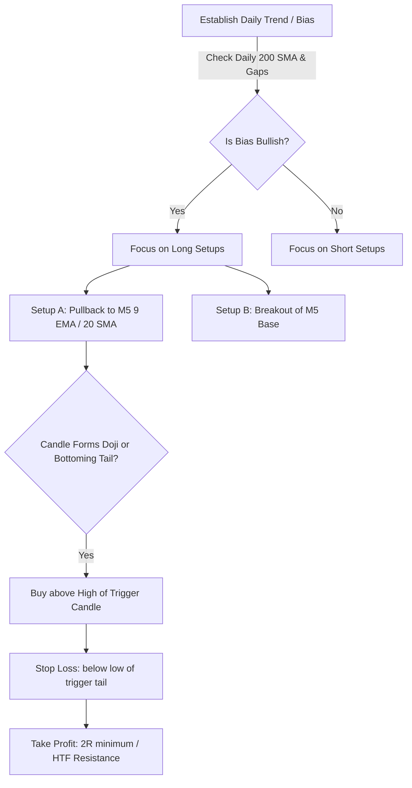

# Day Trading Plan & Course Alignment Audit

This document audits the **Aura Gold Alerts** system against the rules and strategies presented in the **2026 Day Trading Course (by Emanuel)**, highlights alignment/gaps, and details a concrete day trading plan for Gold (XAUUSD).

---

## 1. Course Rules & Strategy Summary

Emanuel’s 10-hour Day Trading course outlines a systematic, price-action-centric approach:

1. **Indicator Stack**:
   - **9 EMA** (Exponential Moving Average): Measures fast-moving momentum. Price frequently consolidates or bounces off this during strong trends.
   - **20 SMA** (Simple Moving Average): The "ultimate trend-following tool". Acts as dynamic support/resistance.
   - **200 SMA** (Simple Moving Average): Long-term trend filter and dynamic ceiling (resistance) or floor (support).
2. **Trend Identification**:
   - **Uptrend**: Price > 20 SMA, 20 SMA is rising, and 9 EMA > 20 SMA.
   - **Downtrend**: Price < 20 SMA, 20 SMA is declining, and 9 EMA < 20 SMA.
   - **Sideways/Chop**: Flat 20 SMA. Avoid trading or wait for a breakout.
3. **Core Setups**:
   - **Retracement/Pullback**: Wait for price to pull back to the 9 EMA or 20 SMA. Enter on a doji, bottoming tail (long), or topping tail (short) with a stop below/above the tail.
   - **Breakout (Base)**: Buy the breakout above a tight horizontal consolidation range (base) that corrected through time.
   - **Failed Breakdown (Shakeout / Amplifier)**: If a bullish stock attempts to break support, fails, forms a bottoming tail, and closes back in the range, enter long on the recovery (stop below the shakeout low).
4. **Risk Management**:
   - Define a fixed risk unit ($R$) before entry.
   - Cut losses immediately (be a "good loser"). Scale risk gradually.
   - Never buy extended (far from the 9 EMA/20 SMA).

---

## 2. System Alignment Audit

| Course Strategy Element | Current Aura Gold Alerts Implementation | Alignment Status |
| :--- | :--- | :--- |
| **Trend Indicators** | Computes EMA20, EMA50, EMA200 on higher timeframes (H1, H4). | **Partial Alignment**. Uses EMAs instead of SMAs, and period 50 instead of 9. |
| **EMA Alignment Stack** | Checks `EMA20 > EMA50 > EMA200` or `EMA5 > EMA10 > EMA20`. | **Partial Alignment**. Course recommends `9 EMA > 20 SMA > 200 SMA`. |
| **Ranging/Chop Filter** | Scales trend down and reversion up if ADX < 20. | **Strong Alignment**. Safely detects and flags ranging regimes to avoid chop. |
| **Retracement / Pullback** | Calculates Order Blocks and Fair Value Gaps (FVG) for pullback zones. | **Strong Alignment**. Pullbacks are mapped via institutional liquidity zones. |
| **Doji / Bottoming Tails** | Detects candles and uses them in scoring, but doesn't explicitly flag "failed breakouts/shakeouts". | **Partial Alignment**. Pinbars/Dojis are scored but not treated as structural triggers. |
| **Gaps & Bias** | Normalizes candles and indicators but has no overnight gap detection. | **Gap**. Emanuel heavily relies on overnight gaps to establish daily bias. |

---

## 3. Concrete Day Trading Plan: XAUUSD (Gold)

Gold is highly liquid and trends strongly, making it the perfect asset to trade using these course rules on intraday timeframes (M5/M15).

### Step 1: Establish Daily Bias (Higher Timeframe)
- **Rules**:
  1. Open the daily (D1) chart of **XAUUSDm**.
  2. If price is above the **200 SMA**, the macro bias is bullish. If below, bearish.
  3. Identify if Gold gapped overnight (e.g. news release or market open). A gap up indicates strong bullish intent; focus strictly on longs.

### Step 2: Timeframe Coordination & Trend Tracking
- **Rules**:
  - Main trading chart: **5-minute (M5)**.
  - Confirmation/Timing chart: **2-minute (M2)**.
  - Setup validation: Look for **9 EMA > 20 SMA** (bullish alignment) and both averages pointing upward. Avoid trading if the M5 20 SMA is flat.

### Step 3: Execution Setups
#### Setup A: The MA Pullback (Continuation)
- **Setup**: Price breaks out, extends, and then pulls back to the rising **9 EMA** or **20 SMA** on the M5 chart.
- **Trigger**: Look for a **Bottoming Tail** (pinbar) or a **Doji** to form right on or near the moving average.
- **Entry**: Place a buy stop order $0.10$ pips above the high of the trigger candle.
- **Stop Loss**: Place the stop $0.10$ pips below the low of the tail.
- **Target**: Minimum target of $2R$ (twice the risk) or the recent swing high.

#### Setup B: The M5 Shakeout (Failed Breakdown)
- **Setup**: Gold is consolidating sideways at the highs of the morning move. Sellers attempt to push price below the consolidation support line, but the breakdown fails immediately.
- **Trigger**: The breakdown candle reverses, closing as a long **Bottoming Tail** back inside the consolidation base.
- **Entry**: Buy immediately upon the candle close or place a buy stop above the shakeout bar's high.
- **Stop Loss**: Strict stop loss just below the low of the bottoming tail.
- **Target**: $3R$ or higher, as shakeouts often lead to explosive breakouts.

---

## 4. Proposed System Enhancements

To make the **Aura Gold Alerts** backend and frontend strictly follow this course, we propose implementing a **"Tutorial Mode"** or updating the indicator stack:

### A. Backend indicator calculation additions:
1. Implement `calculateSMA(candles, period)` in `signalEngine.js` to support simple moving averages.
2. Add calculation for:
   - **9 EMA** (`calculateEMA(candles, 9)`)
   - **20 SMA** (`calculateSMA(candles, 20)`)
   - **200 SMA** (`calculateSMA(candles, 200)`)
3. Code an explicit **EMA/SMA Alignment Stack**:
   - `ema9 = calculateEMA(candles, 9)`
   - `sma20 = calculateSMA(candles, 20)`
   - `sma200 = calculateSMA(candles, 200)`
   - Bullish Alignment: `ema9 > sma20 && sma20 > sma200 && sma20 > sma20_prev` (rising).

### B. Setup Detection Engines:
1. **Pullback Detector**: Flag when price touches the 9 EMA or 20 SMA and forms a Doji/Hammer.
2. **Shakeout Detector**: Flag when a candle breaks a support level but closes back inside, creating a bottoming tail.
3. **Extension Watcher**: Suppress buy signals if price is $> 2 \times ATR$ away from the 9 EMA.

---

## 5. Implementation Update (2026-06-21)

After reviewing the **Master Market Structure** course against the live engine, we built a **Day Trading Desk** (`/day-trading-desk`) instead of the literal SMA "Tutorial Mode" — because the engine already implements this course's method directly and adding a parallel 9EMA/20SMA/200SMA stack would duplicate existing trend logic without adding edge.

**What shipped (advisory, read-only — no change to live signal logic):**
- Backend `GET /api/day-trading/desk?symbol=&timeframe=` (`buildStructureDesk`): per-symbol trend phase, **close-confirmed BOS** (`detectMarketStructure` uses close, not wick), **liquidity sweep** (wick-through that closed back inside), **demand/supply zone** (order block) + **imbalance** (FVG), HTF bias, the armed **setup** (pullback / breakout / shakeout), **extension** guard (`emaDistanceAtr`), and the entry/SL/TP plan. Plus a curated **watchlist**.
- Frontend page **Day Trading Desk** (`frontend/pages/DayTradingDesk.tsx`).

**Honest corrections to §1–2 above:**
- **Gaps:** overnight-gap bias is a *stock* concept; XAUUSD/forex is 24/5, so the only real gap is the weekend. The "no gap detection" finding is low-relevance for gold — **not** implemented by design.
- **SMA stack vs structure:** the SMA stack belongs to the *stock* day-trading course. This *market-structure* course (BOS / sweep / supply-demand / imbalance) is what the engine already does well, so the Desk surfaces that rather than adding SMAs. Verified in code: `signalEngine.js:294-295` (BOS = close), `:315-316` (sweep = wick-through + close back inside).
- A separate **Pre-Session Brief** (`/day-trading`) already provides daily bias, R-budget, extension, and news.
