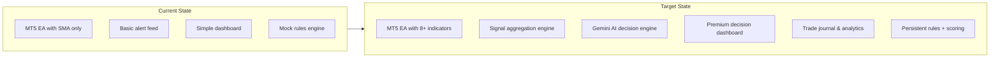
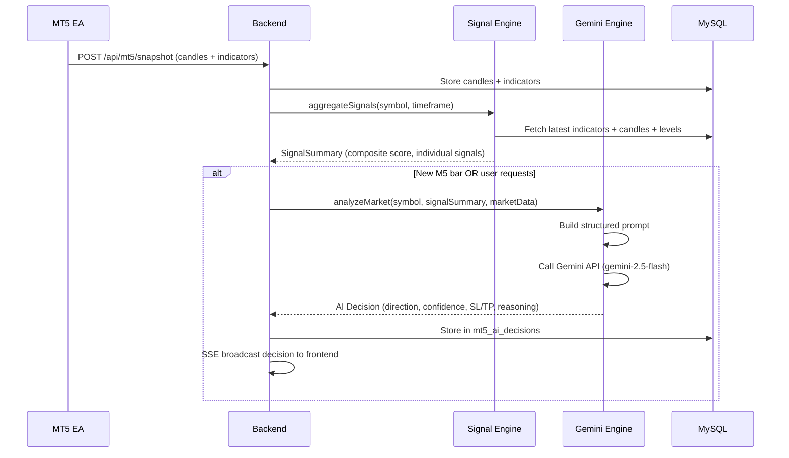

# 🚀 Aura Gold — Super Trading Decision App

Transform the existing alert system into an **AI-powered trading decision engine** that aggregates all signals, stores complete market data, and uses Gemini AI to produce precise buy/sell/hold recommendations.

---

## Current State → Target State



---

## User Review Required

> [!IMPORTANT]
> **Gemini API Key**: You mentioned adding the Gemini API. The plan assumes you'll provide a Google AI Studio API key (`GEMINI_API_KEY`) that we'll store in `.env.local`. The existing Vertex AI proxy will be **replaced** with direct Gemini API calls (simpler, no GCP auth needed).

> [!IMPORTANT]  
> **Database**: The current MySQL on Hostinger (`srv502.hstgr.io`) will be used. We'll add ~5 new tables. Confirm this DB has enough capacity for growing historical data (candles accumulate fast — ~3,360 rows per 30-second snapshot cycle).

> [!WARNING]
> **Breaking UI Change**: The entire frontend will be redesigned with a premium dark trading terminal aesthetic. The current gold-themed UI will be replaced. All existing pages will be preserved but visually overhauled.

---

## Open Questions

> [!IMPORTANT]
> 1. **Which Gemini model?** — Plan assumes `gemini-2.5-flash` for cost-efficiency on frequent calls. Do you want `gemini-2.5-pro` for higher accuracy (higher cost)?
> 2. **Auto-trade or advisory only?** — Should the app only *recommend* trades, or should it eventually send trade commands back to MT5? Plan assumes **advisory only** (safer).
> 3. **How often should Gemini analyze?** — Every new bar (30s)? Every minute? On-demand only? Plan assumes **every new M5 bar + on-demand** to balance cost/speed.
> 4. **Which symbols to focus on?** — Currently the EA tracks up to 12. Should the AI analyze all of them or focus on XAUUSD (gold) only?

---

## Proposed Changes — 4 Phases

---

### Phase 1: Enhanced Market Data & Technical Indicators

The MT5 EA currently only calculates SMA crossover. We need a full arsenal of technical indicators computed in MQ5 and sent to the backend for storage and analysis.

#### [MODIFY] [AuraGoldSignals.mq5](file:///c:/Users/ADMIN/OneDrive/Documents/PERSONAL/DEVELOPMENTS/aura-gold-alerts/AuraGoldSignals.mq5)

Add calculation and transmission of these indicators for each symbol/timeframe:

| Indicator | Parameters | Signal Generated |
|-----------|-----------|-----------------|
| **RSI** (Relative Strength Index) | Period: 14 | Overbought (>70) / Oversold (<30) |
| **MACD** | Fast: 12, Slow: 26, Signal: 9 | Bullish/Bearish crossover, histogram divergence |
| **Bollinger Bands** | Period: 20, StdDev: 2 | Price touching upper/lower band, squeeze |
| **ATR** (Average True Range) | Period: 14 | Volatility level for position sizing |
| **Stochastic** | K: 14, D: 3, Slowing: 3 | Overbought/Oversold crossovers |
| **EMA** (Exponential MA) | 9, 21, 50, 200 | Trend direction, golden/death cross |
| **ADX** (Average Directional Index) | Period: 14 | Trend strength (>25 = strong trend) |
| **Volume Profile** | Current vs 20-bar avg | Volume confirmation |

Changes:
- Add indicator handles in `OnInit()` using `iRSI()`, `iMACD()`, `iBands()`, `iATR()`, `iStochastic()`, `iMA()`, `iADX()`
- Create `BuildIndicatorPayload()` function that computes all indicator values for current bar
- Add indicator data to the `/api/mt5/snapshot` JSON payload under `"indicators"` key
- Add new signal detection functions: `CheckRsiSignal()`, `CheckMacdSignal()`, `CheckBollingerSignal()`, `CheckStochasticSignal()`, `CheckEmaCrossover()`, `CheckAdxSignal()`
- Each signal detection sends to `/api/mt5/signals` with `type` field indicating which indicator triggered

---

#### [MODIFY] [server.js](file:///c:/Users/ADMIN/OneDrive/Documents/PERSONAL/DEVELOPMENTS/aura-gold-alerts/backend/server.js)

**New Database Tables** (added to `initializeDatabase()`):

```sql
-- Store computed indicator values for each candle
CREATE TABLE IF NOT EXISTS mt5_indicators (
    id VARCHAR(255) PRIMARY KEY,          -- symbol|timeframe|time|indicator
    symbol VARCHAR(20) NOT NULL,
    timeframe VARCHAR(10) NOT NULL,
    candle_time BIGINT NOT NULL,
    indicator_name VARCHAR(50) NOT NULL,  -- 'RSI', 'MACD', 'BB', 'ATR', etc.
    value_1 DOUBLE,                       -- Primary value (RSI value, MACD main, BB middle)
    value_2 DOUBLE,                       -- Secondary (MACD signal, BB upper)
    value_3 DOUBLE,                       -- Tertiary (MACD histogram, BB lower)
    value_4 DOUBLE,                       -- Extra (ADX +DI, Stoch %K)
    value_5 DOUBLE,                       -- Extra (ADX -DI, Stoch %D)
    created_at TIMESTAMP DEFAULT CURRENT_TIMESTAMP,
    INDEX idx_symbol_tf (symbol, timeframe),
    INDEX idx_time (candle_time)
);

-- Store AI-generated trading decisions
CREATE TABLE IF NOT EXISTS mt5_ai_decisions (
    id INT AUTO_INCREMENT PRIMARY KEY,
    symbol VARCHAR(20) NOT NULL,
    timeframe VARCHAR(10) NOT NULL,
    decision ENUM('STRONG_BUY', 'BUY', 'HOLD', 'SELL', 'STRONG_SELL') NOT NULL,
    confidence DECIMAL(5,2) NOT NULL,     -- 0-100%
    entry_price DOUBLE,
    stop_loss DOUBLE,
    take_profit_1 DOUBLE,
    take_profit_2 DOUBLE,
    take_profit_3 DOUBLE,
    risk_reward_ratio DECIMAL(5,2),
    reasoning TEXT,                         -- AI's full reasoning
    signals_snapshot JSON,                 -- All signals at decision time
    indicators_snapshot JSON,              -- All indicator values at decision time
    market_context JSON,                   -- Trend, volatility, key levels
    outcome ENUM('WIN', 'LOSS', 'BREAKEVEN', 'PENDING', 'EXPIRED') DEFAULT 'PENDING',
    outcome_pips DOUBLE,
    created_at TIMESTAMP DEFAULT CURRENT_TIMESTAMP,
    expired_at TIMESTAMP NULL,
    INDEX idx_symbol (symbol),
    INDEX idx_decision (decision),
    INDEX idx_created (created_at)
);

-- Trade journal for tracking decision accuracy
CREATE TABLE IF NOT EXISTS mt5_trade_journal (
    id INT AUTO_INCREMENT PRIMARY KEY,
    decision_id INT,                       -- Links to ai_decisions
    ticket BIGINT,                         -- MT5 trade ticket
    symbol VARCHAR(20) NOT NULL,
    direction ENUM('BUY', 'SELL') NOT NULL,
    entry_price DOUBLE NOT NULL,
    exit_price DOUBLE,
    stop_loss DOUBLE,
    take_profit DOUBLE,
    lot_size DOUBLE,
    profit_loss DOUBLE,
    pips DOUBLE,
    duration_minutes INT,
    notes TEXT,
    tags JSON,                             -- ['ai_suggested', 'manual', 'scalp', etc.]
    opened_at TIMESTAMP DEFAULT CURRENT_TIMESTAMP,
    closed_at TIMESTAMP NULL,
    FOREIGN KEY (decision_id) REFERENCES mt5_ai_decisions(id),
    INDEX idx_symbol (symbol),
    INDEX idx_opened (opened_at)
);

-- Persistent signal rules (replacing frontend-only mock)
CREATE TABLE IF NOT EXISTS mt5_signal_rules (
    id INT AUTO_INCREMENT PRIMARY KEY,
    name VARCHAR(100) NOT NULL,
    description TEXT,
    indicator VARCHAR(50) NOT NULL,        -- 'RSI', 'MACD', 'PRICE', etc.
    condition_type VARCHAR(50) NOT NULL,   -- 'CROSSES_ABOVE', 'CROSSES_BELOW', 'GREATER_THAN', etc.
    threshold_value DOUBLE,
    threshold_value_2 DOUBLE,              -- For range conditions
    symbols JSON DEFAULT ('["XAUUSD"]'),
    timeframes JSON DEFAULT ('["M5","H1"]'),
    is_active BOOLEAN DEFAULT TRUE,
    weight DECIMAL(3,2) DEFAULT 1.00,      -- Signal weight for aggregation (0.1-2.0)
    notify_email BOOLEAN DEFAULT TRUE,
    created_at TIMESTAMP DEFAULT CURRENT_TIMESTAMP,
    updated_at TIMESTAMP DEFAULT CURRENT_TIMESTAMP ON UPDATE CURRENT_TIMESTAMP
);

-- Market structure / key price levels
CREATE TABLE IF NOT EXISTS mt5_market_levels (
    id INT AUTO_INCREMENT PRIMARY KEY,
    symbol VARCHAR(20) NOT NULL,
    level_type ENUM('SUPPORT', 'RESISTANCE', 'PIVOT', 'FIBONACCI', 'PSYCHOLOGICAL', 'AI_DETECTED') NOT NULL,
    price DOUBLE NOT NULL,
    strength INT DEFAULT 1,                -- How many times tested
    source VARCHAR(50),                    -- 'manual', 'auto', 'ai'
    notes TEXT,
    is_active BOOLEAN DEFAULT TRUE,
    created_at TIMESTAMP DEFAULT CURRENT_TIMESTAMP,
    INDEX idx_symbol (symbol),
    INDEX idx_active (is_active)
);
```

**New API Endpoints:**

| Method | Path | Purpose |
|--------|------|---------|
| `POST` | `/api/mt5/indicators` | Ingest indicator values from MT5 |
| `GET` | `/api/mt5/indicators` | Get indicator history (symbol, timeframe, indicator filters) |
| `GET` | `/api/mt5/indicators/latest` | Get latest values for all indicators for a symbol |
| `POST` | `/api/ai/analyze` | Trigger Gemini AI analysis for a symbol |
| `GET` | `/api/ai/decisions` | Get AI decision history |
| `GET` | `/api/ai/decisions/latest` | Get latest decision per symbol |
| `GET` | `/api/ai/decisions/:id` | Get specific decision with full context |
| `PATCH` | `/api/ai/decisions/:id/outcome` | Update decision outcome (win/loss) |
| `GET` | `/api/ai/accuracy` | Get AI decision accuracy stats |
| `GET` | `/api/journal` | Get trade journal entries |
| `POST` | `/api/journal` | Create journal entry |
| `PATCH` | `/api/journal/:id` | Update journal entry (close trade, add notes) |
| `GET` | `/api/journal/stats` | Performance statistics |
| `GET` | `/api/rules` | Get all signal rules |
| `POST` | `/api/rules` | Create a signal rule |
| `PUT` | `/api/rules/:id` | Update a signal rule |
| `DELETE` | `/api/rules/:id` | Delete a signal rule |
| `GET` | `/api/market-levels` | Get key price levels |
| `POST` | `/api/market-levels` | Add/update price level |
| `GET` | `/api/analytics/signals` | Signal performance analytics |
| `GET` | `/api/analytics/correlations` | Indicator correlation analysis |

---

### Phase 2: Signal Aggregation Engine (Backend)

A new module that combines all signals into a composite score.

#### [NEW] [signalEngine.js](file:///c:/Users/ADMIN/OneDrive/Documents/PERSONAL/DEVELOPMENTS/aura-gold-alerts/backend/signalEngine.js)

**Signal Aggregation Logic:**

```
┌─────────────────────────────────────────────────┐
│              Signal Aggregation Engine            │
├─────────────────────────────────────────────────┤
│                                                   │
│  Input Signals (each weighted 0.1 - 2.0):        │
│  ├── RSI Signal        (weight: 1.0)             │
│  ├── MACD Signal       (weight: 1.2)             │
│  ├── Bollinger Signal  (weight: 0.8)             │
│  ├── SMA Crossover     (weight: 1.5)             │
│  ├── EMA Crossover     (weight: 1.3)             │
│  ├── Stochastic Signal (weight: 0.9)             │
│  ├── ADX Trend Str.    (weight: 1.0)             │
│  ├── Volume Confirm.   (weight: 0.7)             │
│  └── Key Level Prox.   (weight: 1.4)             │
│                                                   │
│  Each signal outputs: -1 (sell) to +1 (buy)      │
│                                                   │
│  Composite Score = Σ(signal × weight) / Σ(weight)│
│                                                   │
│  Score Interpretation:                            │
│  ├── > +0.6  → STRONG BUY                        │
│  ├── > +0.3  → BUY                               │
│  ├── -0.3 to +0.3 → HOLD                         │
│  ├── < -0.3  → SELL                              │
│  └── < -0.6  → STRONG SELL                       │
│                                                   │
│  Confluence Check:                                │
│  Must have ≥3 signals agreeing for BUY/SELL      │
│  Must have ≥5 signals agreeing for STRONG        │
│                                                   │
│  Multi-Timeframe Confirmation:                    │
│  M5 signal + H1 trend agreement = boost 20%      │
│  M5 against H1 = reduce confidence 30%           │
│                                                   │
└─────────────────────────────────────────────────┘
```

Key features:
- Weighted signal scoring with configurable weights per rule
- Confluence detection (multiple signals agreeing)
- Multi-timeframe analysis (M5 vs H1 vs H4 trend alignment)
- Automatic signal conflict detection
- Key support/resistance proximity scoring
- Volume confirmation filter
- Outputs a structured `SignalSummary` object used by the AI engine

---

### Phase 3: Gemini AI Decision Engine

#### [NEW] [geminiEngine.js](file:///c:/Users/ADMIN/OneDrive/Documents/PERSONAL/DEVELOPMENTS/aura-gold-alerts/backend/geminiEngine.js)

Integration with Google's Gemini API for intelligent trade analysis.

**Architecture:**



**Gemini Prompt Structure:**
```
You are an expert gold (XAUUSD) trader. Analyze the following market data 
and provide a precise trading decision.

## Current Market State
- Price: {bid}/{ask}, Spread: {spread}
- Trend (H4): {trend}, Trend (H1): {trend}, Trend (M5): {trend}

## Technical Indicators (M5)
- RSI(14): {value} — {interpretation}
- MACD(12,26,9): Main={value}, Signal={value}, Hist={value}
- Bollinger(20,2): Upper={value}, Middle={value}, Lower={value}
- ATR(14): {value}
- Stochastic(14,3,3): %K={value}, %D={value}
- EMA 9/21/50/200: {values}
- ADX(14): {value}, +DI={value}, -DI={value}

## Signal Aggregation
- Composite Score: {score} ({interpretation})
- Bullish Signals: {count} — {list}
- Bearish Signals: {count} — {list}
- Confluence: {level}

## Key Levels
- Nearest Support: {price} (strength: {n})
- Nearest Resistance: {price} (strength: {n})

## Recent Price Action (last 20 M5 candles)
{OHLCV data}

## Account Context
- Balance: {balance}, Equity: {equity}
- Open Positions: {count}, Current P/L: {pnl}

## Recent AI Decisions (last 5)
{previous decisions and outcomes for learning}

---

Respond in STRICT JSON format:
{
  "decision": "STRONG_BUY|BUY|HOLD|SELL|STRONG_SELL",
  "confidence": 0-100,
  "entry_price": number,
  "stop_loss": number,
  "take_profit_1": number (1:1 RR),
  "take_profit_2": number (1:2 RR),
  "take_profit_3": number (1:3 RR),
  "risk_reward_ratio": number,
  "reasoning": "2-3 sentence explanation",
  "key_factors": ["factor1", "factor2", "factor3"],
  "risk_level": "LOW|MEDIUM|HIGH",
  "suggested_lot_size": number (based on 1-2% risk of balance)
}
```

**Features:**
- Structured JSON response parsing with validation
- Fallback to signal engine score if Gemini fails
- Rate limiting (max 1 call per symbol per 5 minutes)
- Decision caching and deduplication
- Cost tracking (token usage)
- Historical accuracy feedback loop (sends past decision outcomes in prompt)

#### [MODIFY] [.env.local](file:///c:/Users/ADMIN/OneDrive/Documents/PERSONAL/DEVELOPMENTS/aura-gold-alerts/backend/.env.local)

Add:
```
GEMINI_API_KEY=your-api-key-here
GEMINI_MODEL=gemini-2.5-flash
AI_ANALYSIS_INTERVAL_MS=300000
AI_MIN_CONFIDENCE=60
```

---

### Phase 4: Premium Trading Terminal UI

Complete frontend redesign with a professional dark trading terminal aesthetic.

#### Design System

| Token | Value | Usage |
|-------|-------|-------|
| `--bg-primary` | `#0a0e17` | Main background (deep navy-black) |
| `--bg-secondary` | `#111827` | Card backgrounds |
| `--bg-tertiary` | `#1a2332` | Elevated surfaces |
| `--accent-gold` | `#f59e0b` | Primary accent (gold) |
| `--accent-gold-dim` | `#92600a` | Muted gold |
| `--buy-green` | `#10b981` | Buy signals, profit |
| `--sell-red` | `#ef4444` | Sell signals, loss |
| `--hold-blue` | `#3b82f6` | Hold signals, neutral |
| `--text-primary` | `#f3f4f6` | Primary text |
| `--text-secondary` | `#9ca3af` | Secondary text |
| `--glass` | `rgba(17,24,39,0.7)` | Glassmorphism panels |
| `--border` | `rgba(245,158,11,0.15)` | Subtle gold borders |

**Typography:** Inter (headings) + JetBrains Mono (numbers/data)

---

#### [NEW] [styles/trading-terminal.css](file:///c:/Users/ADMIN/OneDrive/Documents/PERSONAL/DEVELOPMENTS/aura-gold-alerts/frontend/styles/trading-terminal.css)

Complete CSS design system with:
- Dark trading terminal theme
- Glassmorphism card components
- Animated signal indicators (pulsing buy/sell badges)
- Gradient borders on active elements
- Smooth micro-transitions on all interactive elements
- Responsive grid layouts
- Custom scrollbar styling

---

#### [MODIFY] [App.tsx](file:///c:/Users/ADMIN/OneDrive/Documents/PERSONAL/DEVELOPMENTS/aura-gold-alerts/frontend/App.tsx)

Update routes:

| Route | Page | Description |
|-------|------|-------------|
| `/` | **TradingTerminal** (new) | Main decision dashboard — the command center |
| `/signals` | **SignalDashboard** (new) | All signals with aggregation view |
| `/analysis` | **AIAnalysis** (new) | AI decision history, accuracy stats |
| `/journal` | **TradeJournal** (new) | Trade journal with P/L tracking |
| `/chart` | **AdvancedChart** (enhanced) | Multi-indicator chart |
| `/rules` | **RulesManagement** (enhanced) | Backend-persisted rules |
| `/alerts` | AlertHistory (enhanced) | Signal/alert history |
| `/settings` | **Settings** (enhanced) | Connection + notification + AI settings |
| `/login` | Login (enhanced) | Redesigned login |

---

#### [NEW] [pages/TradingTerminal.tsx](file:///c:/Users/ADMIN/OneDrive/Documents/PERSONAL/DEVELOPMENTS/aura-gold-alerts/frontend/pages/TradingTerminal.tsx)

**The main command center** — a single-screen trading decision dashboard:

```
┌─────────────────────────────────────────────────────────────┐
│  AURA GOLD — Trading Terminal                    ● MT5 Live │
├──────────────────────┬──────────────────────────────────────┤
│                      │  ┌──────────────────────────────┐    │
│   🟢 AI DECISION     │  │    XAUUSD Candlestick Chart  │    │
│   ═══════════════    │  │    with indicator overlays    │    │
│   STRONG BUY         │  │    (RSI, MACD, BB, EMA)      │    │
│   Confidence: 87%    │  │                              │    │
│                      │  │    ← Multi-timeframe tabs →   │    │
│   Entry: 2,347.50    │  └──────────────────────────────┘    │
│   SL: 2,342.00       │                                      │
│   TP1: 2,353.00      │  ┌──────────┬──────────┬────────┐   │
│   TP2: 2,358.50      │  │  Signal  │  Signal  │ Signal │   │
│   TP3: 2,364.00      │  │  RSI:🟢  │ MACD:🟢  │ BB:🟡  │   │
│   R:R = 1:2.0        │  │  Over-   │ Bullish  │ Middle │   │
│                      │  │  sold    │ Cross    │ Band   │   │
│   Risk: MEDIUM       │  ├──────────┼──────────┼────────┤   │
│   Lot Size: 0.05     │  │  SMA:🟢  │ Stoch:🟢 │ ADX:🟢 │   │
│                      │  │  Golden  │ Over-    │ Strong │   │
│   "Gold showing      │  │  Cross   │ sold     │ Trend  │   │
│    strong bullish     │  ├──────────┼──────────┼────────┤   │
│    momentum with      │  │  EMA:🟢  │ Vol:🟡   │ Level  │   │
│    RSI divergence..." │  │  9>21>50 │ Average  │ 🟢Supp │   │
│                      │  └──────────┴──────────┴────────┘   │
│   [Ask AI Again]     │                                      │
│                      │  ┌──────────────────────────────┐    │
├──────────────────────┤  │  Composite Score Gauge        │    │
│  📊 ACCOUNT          │  │  ◄━━━━━━━━●━━━━━►            │    │
│  Balance: $10,000    │  │  -1  SELL  0  BUY  +1        │    │
│  Equity:  $10,150    │  │  Score: +0.72 (STRONG BUY)   │    │
│  Open P/L: +$150     │  └──────────────────────────────┘    │
│  Open Trades: 2      │                                      │
│                      │  ┌──────────────────────────────┐    │
│  📈 QUICK STATS      │  │  Recent AI Decisions          │    │
│  Today:   +1.2%      │  │  10:05 BUY  87% ✅ +35 pips  │    │
│  Week:    +3.4%      │  │  09:30 HOLD 45% ⬜ —         │    │
│  AI Win Rate: 72%    │  │  09:00 SELL 91% ✅ +52 pips  │    │
│  Total Signals: 847  │  │  08:15 BUY  63% ❌ -18 pips  │    │
└──────────────────────┴──└──────────────────────────────┘────┘
```

Features:
- Real-time SSE updates for all panels
- Pulsing animation on new AI decisions
- Color-coded confidence levels
- One-click "Ask AI Again" button
- Glassmorphism card design
- Responsive (works on mobile for quick checks)

---

#### [NEW] [pages/AIAnalysis.tsx](file:///c:/Users/ADMIN/OneDrive/Documents/PERSONAL/DEVELOPMENTS/aura-gold-alerts/frontend/pages/AIAnalysis.tsx)

AI performance analytics page:
- Decision accuracy chart (win rate over time using recharts)
- Confidence vs outcome scatter plot
- Best/worst performing signal combinations
- AI decision log with full reasoning expandable
- Filter by symbol, timeframe, date range, decision type

---

#### [NEW] [pages/TradeJournal.tsx](file:///c:/Users/ADMIN/OneDrive/Documents/PERSONAL/DEVELOPMENTS/aura-gold-alerts/frontend/pages/TradeJournal.tsx)

Professional trade journal:
- Log trades (manual or auto-linked from MT5)
- Tag trades (AI-suggested, manual, scalp, swing, etc.)
- Attach AI decision that prompted the trade
- P/L tracking with cumulative equity curve
- Notes and lessons learned per trade
- Export to CSV

---

#### [NEW] [pages/SignalDashboard.tsx](file:///c:/Users/ADMIN/OneDrive/Documents/PERSONAL/DEVELOPMENTS/aura-gold-alerts/frontend/pages/SignalDashboard.tsx)

All-signals-at-a-glance view:
- Matrix grid: indicators (rows) × timeframes (columns)
- Each cell shows signal direction (🟢 buy / 🔴 sell / 🟡 neutral)
- Real-time updates via SSE
- Click any cell to see indicator chart overlay
- Composite score bar for each timeframe

---

#### [MODIFY] [components/Mt5CandlestickChart.tsx](file:///c:/Users/ADMIN/OneDrive/Documents/PERSONAL/DEVELOPMENTS/aura-gold-alerts/frontend/components/Mt5CandlestickChart.tsx)

Enhance with:
- RSI subplot below chart
- MACD subplot with histogram
- Bollinger Band overlay on main chart
- EMA lines (9, 21, 50, 200) overlay
- AI decision markers (▲ BUY / ▼ SELL with confidence badge)
- Support/resistance horizontal lines
- Timeframe selector tabs
- Toggle checkboxes for each indicator overlay

---

#### [MODIFY] [pages/RulesManagement.tsx](file:///c:/Users/ADMIN/OneDrive/Documents/PERSONAL/DEVELOPMENTS/aura-gold-alerts/frontend/pages/RulesManagement.tsx)

Connect to backend API:
- CRUD operations via `/api/rules` endpoints
- Signal weight slider (0.1 - 2.0) for aggregation engine
- Active/inactive toggle persisted
- Rule testing: preview what signal would fire on current data
- Notification preferences per rule

---

#### [MODIFY] [types.ts](file:///c:/Users/ADMIN/OneDrive/Documents/PERSONAL/DEVELOPMENTS/aura-gold-alerts/frontend/types.ts)

Add TypeScript interfaces:
- `AiDecision`, `SignalSummary`, `IndicatorValue`, `TradeJournalEntry`
- `SignalRule`, `MarketLevel`, `CompositeScore`
- `AiAccuracyStats`, `SignalCorrelation`

---

#### [MODIFY] [mt5Api.ts](file:///c:/Users/ADMIN/OneDrive/Documents/PERSONAL/DEVELOPMENTS/aura-gold-alerts/frontend/mt5Api.ts)

Add API functions:
- `fetchAiDecision()`, `triggerAiAnalysis()`, `fetchAiHistory()`
- `fetchIndicators()`, `fetchLatestIndicators()`
- `fetchJournalEntries()`, `createJournalEntry()`, `updateJournalEntry()`
- `fetchRules()`, `createRule()`, `updateRule()`, `deleteRule()`
- `fetchMarketLevels()`, `fetchAiAccuracy()`
- `fetchSignalSummary()` — composite signal aggregation
- SSE event types: `ai_decision`, `signal_summary`, `indicator_update`

---

#### [MODIFY] [components/Layout.tsx](file:///c:/Users/ADMIN/OneDrive/Documents/PERSONAL/DEVELOPMENTS/aura-gold-alerts/frontend/components/Layout.tsx)

Redesigned sidebar:
- Dark terminal theme
- New navigation items (Trading Terminal, Signals, AI Analysis, Journal)
- Live AI decision badge in sidebar (shows current recommendation)
- Animated gold accent on active route
- Collapsible for more chart space

---

#### [NEW] [components/DecisionCard.tsx](file:///c:/Users/ADMIN/OneDrive/Documents/PERSONAL/DEVELOPMENTS/aura-gold-alerts/frontend/components/DecisionCard.tsx)

Reusable AI decision display component:
- Large decision badge (STRONG BUY/BUY/HOLD/SELL/STRONG SELL)
- Confidence gauge (circular progress)
- Entry/SL/TP levels with pip distances
- Risk/reward visualization
- Reasoning text
- Timestamp + "Ask Again" button
- Animated entrance on new decisions

---

#### [NEW] [components/SignalGrid.tsx](file:///c:/Users/ADMIN/OneDrive/Documents/PERSONAL/DEVELOPMENTS/aura-gold-alerts/frontend/components/SignalGrid.tsx)

Signal matrix component:
- Indicator × Timeframe grid
- Color-coded cells with tooltips
- Composite score row at bottom
- Real-time SSE updates

---

#### [NEW] [components/CompositeGauge.tsx](file:///c:/Users/ADMIN/OneDrive/Documents/PERSONAL/DEVELOPMENTS/aura-gold-alerts/frontend/components/CompositeGauge.tsx)

SVG-based gauge component:
- Semicircular gauge from -1 (STRONG SELL) to +1 (STRONG BUY)
- Animated needle
- Color gradient (red → yellow → green)
- Current score display
- Signal count badge

---

## Summary of All File Changes

| Action | File | Description |
|--------|------|-------------|
| MODIFY | `AuraGoldSignals.mq5` | Add 8 technical indicators + signal detection |
| MODIFY | `backend/server.js` | New DB tables, new API endpoints, signal engine integration |
| MODIFY | `backend/.env.local` | Add Gemini API config |
| NEW | `backend/signalEngine.js` | Signal aggregation engine |
| NEW | `backend/geminiEngine.js` | Gemini AI decision engine |
| MODIFY | `frontend/index.html` | Update theme, fonts (Inter + JetBrains Mono) |
| NEW | `frontend/styles/trading-terminal.css` | Complete dark terminal CSS design system |
| MODIFY | `frontend/App.tsx` | New routes, updated navigation |
| MODIFY | `frontend/types.ts` | New TypeScript interfaces |
| MODIFY | `frontend/mt5Api.ts` | New API functions + SSE events |
| MODIFY | `frontend/components/Layout.tsx` | Redesigned dark sidebar |
| MODIFY | `frontend/components/Mt5CandlestickChart.tsx` | Multi-indicator overlays |
| NEW | `frontend/components/DecisionCard.tsx` | AI decision display |
| NEW | `frontend/components/SignalGrid.tsx` | Signal matrix grid |
| NEW | `frontend/components/CompositeGauge.tsx` | Score gauge visualization |
| NEW | `frontend/pages/TradingTerminal.tsx` | Main command center |
| NEW | `frontend/pages/SignalDashboard.tsx` | All-signals view |
| NEW | `frontend/pages/AIAnalysis.tsx` | AI performance analytics |
| NEW | `frontend/pages/TradeJournal.tsx` | Trade journal |
| MODIFY | `frontend/pages/RulesManagement.tsx` | Backend-connected rules |
| MODIFY | `frontend/pages/Dashboard.tsx` | Restyle with new design system |
| MODIFY | `frontend/pages/Login.tsx` | Premium dark login |

---

## Verification Plan

### Automated Tests
```bash
# Backend API tests
node --test backend/test/signalEngine.test.js
node --test backend/test/geminiEngine.test.js

# Frontend build verification
cd frontend && npm run build

# Full stack dev server
npm run dev
```

### Manual Verification
1. **MT5 → Backend flow**: Verify indicator data arrives and is stored in `mt5_indicators` table
2. **Signal aggregation**: Check composite scores update in real-time via SSE
3. **Gemini AI**: Trigger analysis, verify structured JSON response, check `mt5_ai_decisions` table
4. **UI**: Verify Trading Terminal shows live AI decisions, signals update in real-time
5. **Rules**: Create/edit/delete rules, verify persistence across page reloads
6. **Journal**: Log a trade, link to AI decision, mark outcome
7. **Analytics**: Verify AI accuracy tracking updates after marking outcomes

---

## Implementation Order

```mermaid
gantt
    title Implementation Phases
    dateFormat X
    axisFormat %s
    
    section Phase 1
    DB Schema + New Tables          :1, 2
    Backend Indicator Endpoints     :2, 3
    MQ5 Indicator Calculations      :2, 4
    
    section Phase 2  
    Signal Aggregation Engine       :4, 6
    Rules Backend API               :5, 6
    
    section Phase 3
    Gemini Engine                   :6, 8
    AI Decision Endpoints           :7, 8
    
    section Phase 4
    CSS Design System               :8, 9
    Trading Terminal Page           :9, 11
    Signal Dashboard                :10, 11
    AI Analysis Page                :11, 12
    Trade Journal Page              :11, 12
    Enhanced Chart                  :12, 13
    Polish + Integration            :13, 14
```



> [!TIP]
> **Recommended approach**: Build Phase 1-3 (backend) first, then Phase 4 (UI). This way the data pipeline and AI engine are ready when the UI needs to consume them.
